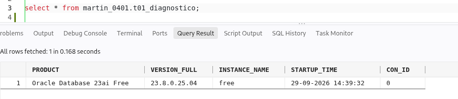

## s-02-diagnostico-bd.sql

Ejecución

```shellsession
[martin@h1-bda-mqr 04]$ sqlplus /nolog

SQL*Plus: Release 23.0.0.0.0 - Production on Tue Sep 29 19:32:27 2026
Version 23.8.0.25.04

Copyright (c) 1982, 2025, Oracle.  All rights reserved.

idle> @s-02-diagnostico-bd.sql
Connected.
old   8:     WHERE username = UPPER('&usuario.');
new   8:     WHERE username = UPPER('MARTIN_0401');
old  12:     EXECUTE IMMEDIATE 'DROP USER &usuario. CASCADE';
new  12:     EXECUTE IMMEDIATE 'DROP USER MARTIN_0401 CASCADE';
old  13:     DBMS_OUTPUT.PUT_LINE('[sqlplus] se ha eliminado &usuario. porque ya existia, preparando para recrear...');
new  13:     DBMS_OUTPUT.PUT_LINE('[sqlplus] se ha eliminado MARTIN_0401 porque ya existia, preparando para recrear...');
old  17:     EXECUTE IMMEDIATE 'CREATE USER &usuario. IDENTIFIED BY "&password."';
new  17:     EXECUTE IMMEDIATE 'CREATE USER MARTIN_0401 IDENTIFIED BY "password_0401"';
old  18:     EXECUTE IMMEDIATE 'GRANT CONNECT, RESOURCE TO &usuario.';
new  18:     EXECUTE IMMEDIATE 'GRANT CONNECT, RESOURCE TO MARTIN_0401';
old  19:     EXECUTE IMMEDIATE 'ALTER USER &usuario. QUOTA UNLIMITED ON USERS';
new  19:     EXECUTE IMMEDIATE 'ALTER USER MARTIN_0401 QUOTA UNLIMITED ON USERS';
old  21:     DBMS_OUTPUT.PUT_LINE('[sqlplus] se ha creado &usuario. desde cero y con los permisos necesarios.');
new  21:     DBMS_OUTPUT.PUT_LINE('[sqlplus] se ha creado MARTIN_0401 desde cero y con los permisos necesarios.');
old  25:     EXECUTE IMMEDIATE 'CREATE TABLE &usuario..t01_diagnostico
new  25:     EXECUTE IMMEDIATE 'CREATE TABLE MARTIN_0401.t01_diagnostico
[sqlplus] se ha eliminado MARTIN_0401 porque ya existia, preparando para
recrear...
[sqlplus] se ha creado MARTIN_0401 desde cero y con los permisos necesarios.

PL/SQL procedure successfully completed.

Disconnected from Oracle Database 23ai Free Release 23.0.0.0.0 - Develop, Learn, and Run for Free
Version 23.8.0.25.04
[martin@h1-bda-mqr 04]$ 
```

### Comprobar que existe

La tabla efectivamente existe

```shellsession
[oracle@h1-bda-mqr ~]$ ORACLE_PDB_SID=mqrbda_s1 sqlplus / as sysdba

SQL*Plus: Release 23.0.0.0.0 - Production on Tue Sep 29 19:41:41 2026
Version 23.8.0.25.04

Copyright (c) 1982, 2025, Oracle.  All rights reserved.


Connected to:
Oracle Database 23ai Free Release 23.0.0.0.0 - Develop, Learn, and Run for Free
Version 23.8.0.25.04

sys@mqrbda_s1> select * from martin_0401.t01_diagnostico;

PRODUCT
--------------------------------------------------------------------------------
VERSION_FULL
--------------------------------------------------------------------------------
INSTANCE_NAME     STARTUP_TIME         CON_ID
---------------- ------------------- ----------
Oracle Database 23ai Free
23.8.0.25.04
free         29-09-2026 14:39:32          0


sys@mqrbda_s1>  
```

Que weba darle formato, mejor desde vscode




